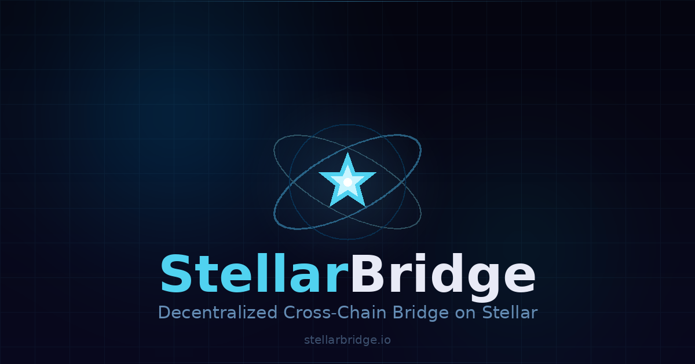

<div align="center">



<br /><br />

# ✦ StellarBridge

### The Decentralized Cross-Chain Bridge on Stellar

*Bridge any asset. Any chain. At the speed of Stellar.*

<br />

</div>

---

## What is StellarBridge?

StellarBridge is a **trustless, non-custodial cross-chain bridge** powered by the Stellar network. It lets anyone move digital assets across blockchains — Ethereum, Polygon, Solana, BSC, and more — with sub-second confirmation times and fees so small they're almost invisible.

Unlike legacy bridges that rely on centralized validators and slow settlement layers, StellarBridge uses Stellar's **Federated Byzantine Agreement (FBA)** consensus to verify every transfer on-chain, without intermediaries, without custody, without compromise.

> **Your keys. Your assets. Your bridge.**

---

## Why Stellar?

| Property | Stellar | Ethereum |
|---|---|---|
| Avg. confirmation | ~5 seconds | ~12 seconds+ |
| Avg. fee | ~$0.0001 | $1–$50+ |
| Consensus | Federated Byzantine Agreement | Proof of Stake |
| Carbon footprint | Carbon-neutral ✓ | High |
| Throughput | 1,000 TPS | ~15–30 TPS |

Stellar was purpose-built for fast, low-cost global asset transfers — making it the ideal foundation for a cross-chain bridge.

---

## Key Features

- **⚡ Sub-Second Finality** — transactions confirm in under 5 seconds, 1000× faster than Ethereum
- **💸 Near-Zero Fees** — Stellar's base fee is 0.00001 XLM (~$0.0001); you keep almost everything
- **🔒 Non-Custodial** — atomic swaps and on-chain escrow mean StellarBridge never holds your funds
- **🌐 Multi-Chain** — bridge assets across Ethereum, Polygon, Solana, BSC, and more
- **🔗 DEX Native** — directly integrated with the Stellar DEX and StellarTerm; bridge and trade in one flow
- **🌿 Carbon Neutral** — Stellar is a certified carbon-neutral network
- **🛡 Audited Protocol** — smart contracts independently audited; active bug bounty program

---

## How It Works

```
User initiates bridge request
        │
        ▼
StellarBridge locks assets in on-chain escrow (source chain)
        │
        ▼
Stellar validators reach FBA consensus on the transfer
        │
        ▼
Equivalent assets released to destination wallet (target chain)
        │
        ▼
Transaction finalized — confirmed on both chains
```

No centralized relayer. No wrapped tokens controlled by a single entity. Every step is verifiable on-chain.

---

## Supported Chains

| Chain | Status |
|---|---|
| Stellar (XLM) | ✅ Live |
| Avalanche (AVAX) | 🔄 Coming Soon |

---

## Security

StellarBridge is built with a security-first architecture:

- **Third-party audits** — all bridge contracts independently reviewed before deployment
- **Decentralized validators** — diverse global quorum; no single point of failure
- **Multi-sig treasury** — protocol funds require 5-of-9 keyholders across different jurisdictions
- **Bug bounty** — responsible disclosure is rewarded; see [`SECURITY.md`](SECURITY.md)
- **Circuit breakers** — automated 24/7 anomaly detection pauses the bridge if suspicious activity is detected

---

## Getting Started

The easiest way to use StellarBridge is through StellarTerm:

**[→ Launch StellarBridge on StellarTerm](https://stellarterm.com)**

You'll need:
1. A Stellar wallet (LOBSTR, Freighter, or any Stellar-compatible wallet)
2. Some XLM for transaction fees (~$0.001 worth is more than enough)
3. The asset you want to bridge

---

## Community & Links

| | |
|---|---|
| 🌐 Website | [stellarbridge.io](https://stellarbridge.io) |
| 🐦 Twitter / X | [@StellarBridge](https://twitter.com/StellarBridge) |
| 💬 Discord | [discord.gg/stellarbridge](https://discord.gg/stellarbridge) |
| 📢 Telegram | [t.me/stellarbridge](https://t.me/stellarbridge) |
| 📖 Stellar Docs | [stellar.org/developers](https://stellar.org/developers) |

---

## Contributing

Contributions, issues, and feature requests are welcome. Please read [`CONTRIBUTING.md`](CONTRIBUTING.md) before opening a pull request.

---

## License

MIT © 2026 StellarBridge

*StellarBridge is an independent open-source project and is not affiliated with the Stellar Development Foundation.*
